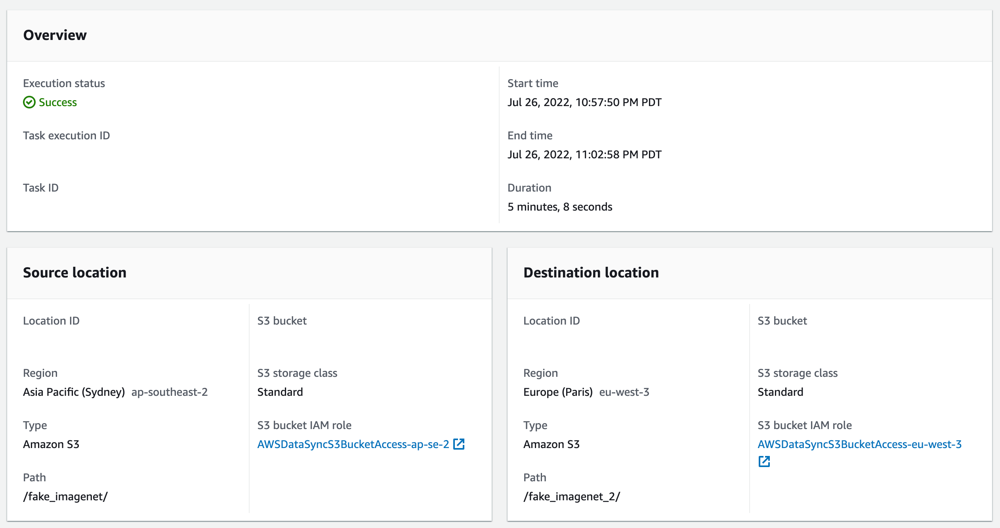
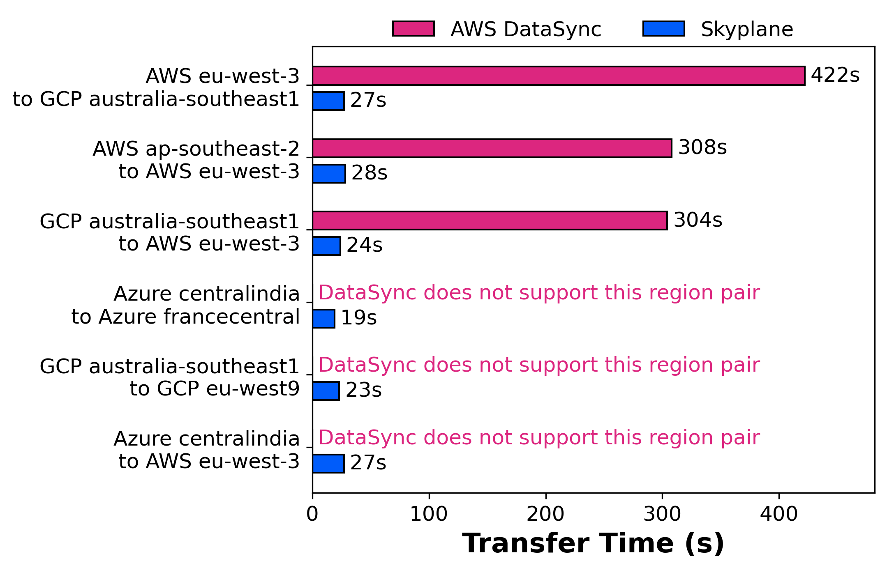
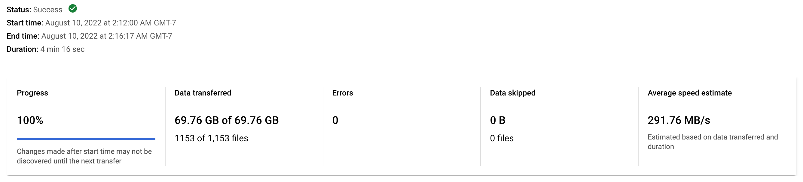
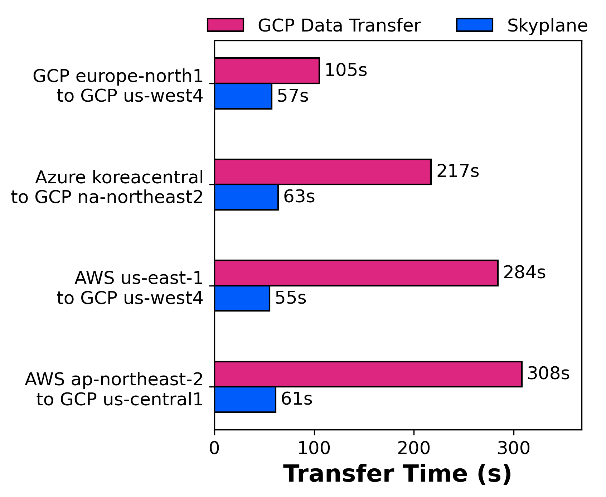
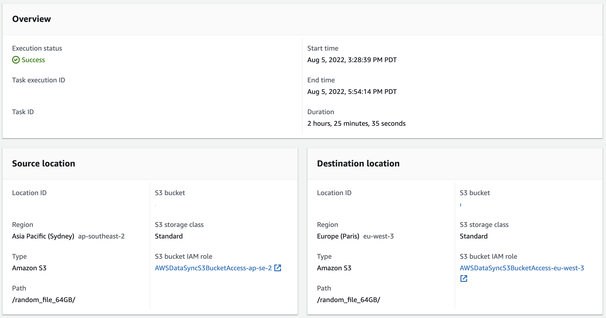

# Skyplane benchmarks

## Skyplane vs AWS DataSync small file

### Setup

For this experiment, we choose **fake_imagenet** (from Google [here](https://cloud.google.com/tpu/docs/tutorials/resnet#run-model)) as the testing file and pick **Sydney** and **Paris** as two endpoints to transfer. The fake_imagenet has size of about 70 GB and contains batches of training, validation, and test datasets.

#### Skyplane

To time the entire process of Skyplane transfer, we use linux `time` command. We add `-y` argument which enables auto confirm to reduce time waiting for response. We use 8 VMs per source/destination region. Below is an example of the code we run:

```bash
$ time skyplane cp -r -y s3://{bucket name in ap-southeast-2 region}/fake_imagenet/ s3://{bucket name in eu-west-3 region}/fake_imagenet/ -n 8
```

In the output, you will find

```bash
✅ Transfer completed successfully
Transfer runtime: 28.11s, Throughput: 19.85Gbps
```

This is the result we include in the plot where we compare only the transfer time (provisioning time, etc. are excluded).

#### DataSync

We use AWS DataSync for comparison. Instructions on how to set up it can be found [here](https://aws.amazon.com/blogs/storage/migrating-google-cloud-storage-to-amazon-s3-using-aws-datasync/). Then, we can launch a task for transfer. Below is a snapshot of such task:



### Result



## Skyplane vs GCP Data Transfer small file

### Setup

For this experiment, we choose **fake_imagenet** (from Google [here](https://cloud.google.com/tpu/docs/tutorials/resnet#run-model)) as the testing file and pick different regions to transfer. The fake_imagenet has size of about 70 GB and contains batches of training, validation, and test datasets.

#### Skyplane

To time the entire process of Skyplane transfer, we use linux `time` command. We add `-y` argument which enables auto confirm to reduce time waiting for response. We use 8 VMs per source/destination region. Below is an example of the code we run:

```bash
$ time skyplane cp -r -y s3://{bucket name in source region}/fake_imagenet/ gs://{bucket name in destination region}/fake_imagenet/ -n 8
```

In the output, you will find

```bash
✅ Transfer completed successfully
Transfer runtime: 28.73s, Throughput: 19.42Gbps
```

This is the result we include in the plot where we compare only the transfer time (provisioning time, etc. are excluded).

#### Data Transfer

We use Google Cloud Data Transfer for comparison. Instructions on how to set up it can be found [here](https://cloud.google.com/storage-transfer/docs/create-transfers). Then, we can launch a job for transfer. Below is a snapshot of such job:



### Result



## Skyplane vs AWS DataSync for large files

### Setup

For this experiment, we choose **randomly** generated **large files** of fixed sizes as the testing file and pick **Sydney** and **Paris** as two endpoints to transfer. The random files have sizes of 4 GB, 8 GB, 16 GB, 32 GB, and 64 GB, each generated by linux command `head -c {size}G </dev/urandom>myfile`.

#### Skyplane

To time the entire process of Skyplane transfer, we use linux `time` command. We add `-y` argument which enables auto confirm to reduce time waiting for response. We use 8 VMs per source/destination region. Below is an example of the code we run:

```bash
$ time skyplane cp -r -y s3://{bucket name in ap-southeast-2 region}/random_file_64GB s3://{bucket name in eu-west-3 region}/random_file_64GB -n 8
```

In the output, you will find

```bash
✅ Transfer completed successfully
Transfer runtime: 76.59s, Throughput: 6.69Gbps
```

This is the result we include in the plot where we compare only the transfer time (provisioning time, etc. are excluded).

#### DataSync

We use AWS DataSync for comparison. Instructions on how to set up it can be found [here](https://aws.amazon.com/blogs/storage/migrating-google-cloud-storage-to-amazon-s3-using-aws-datasync/). Then, we can launch a task for transfer. Below is a snapshot of such task:



### Result

