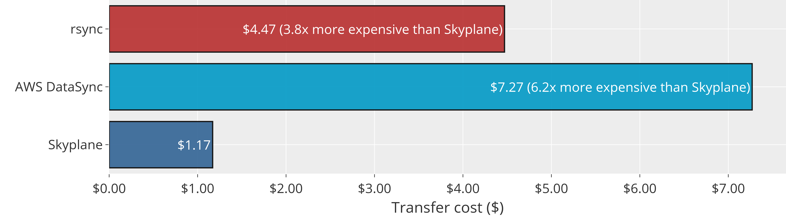

# Benchmarks

This page compares the performance of Skyplane and cloud data transfer tools such as AWS DataSync and Google Cloud Data Transfer. Achieved results vary depending on the region tested, the size of the file, and the number of VMs used.

## Benchmark: Large file benchmark

In this benchmark, we measure the impact of *striping* on large file transfers. We transfer a single large file between two AWS regions. Overall, Skyplane is **113.4x faster** than the AWS DataSync for the largest tested file transfer.


<iframe width="835" height="433" seamless frameborder="0" scrolling="no" src="https://docs.google.com/spreadsheets/d/e/2PACX-1vQIAHMHgwgHW7l0s8Zb5z-oYhZloOcfPsQzWKUheY6hPkDtKsSmn3RvPBDWNyqH0Jok1x2MZgmlJ6j1/pubchart?oid=467969270&amp;format=interactive"></iframe>

Benchmark setup:
* Source: AWS ap-southeast-2 (Sydney)
* Destination: AWS eu-west-3 (Paris)
* Number of files: 1x
* File size: {4, 8, 16, 32, 64}GB
* Number of Skyplane VMs: 8

## Benchmark: Cost comparison w/ compression

In this benchmark, we measure the impact of Skyplane's decompression algorithm which saves a great deal of data egress fee. In addition, Skyplane does not charge any service fee. Overall, Skyplane is 6.2x cheaper than AWS DataSync when transfering uncompressed 220GB dump of English Wikipedia.



Benchmark setup:

* Source: AWS us-east-1 (North Virginia)
* Destination: AWS us-west-2 (Oregon)
* Number of files: ~14,000x (sharded to 16 MB chunks)
* File size: 223.67 GB
* Number of Skyplane VMs: 8

## Benchmark: ImageNet transfer on AWS
In this benchmark, we measure the transfer speed and universal support of Skyplane API. For transfering a 70 GB fake imagenet, Skyplane supports transfers across AWS, GCP, and Azure. It completes the transfer in around 25 seconds for selected transfer region pair below. However, AWS DataSync only supports transfers into and out of AWS services, and it is slow.


Benchmark setup:

* Source: labeled on axis
* Destination: labeled on axis 
* Number of files: 1,152x (training and validation batches)
* File size: 70 GB
* Number of Skyplane VMs: 8

## Benchmark: ImageNet transfer on GCP

In this benchmark, we measure the transfer speed and universal support of Skyplane API. For transfering a 70 GB fake imagenet, Skyplane supports transfers across AWS, GCP, and Azure. It completes the transfer in around 60 seconds for selected transfer region pair below. However, GCP Data Transfer only supports transfers into GCP services, and it is slow.


Benchmark setup:

* Source: labeled on axis
* Destination: labeled on axis 
* Number of files: 1,152x (training and validation batches)
* File size: 70 GB
* Number of Skyplane VMs: 8

## Instructions to replicate benchmarks
To replicate select benchmarks, see the following guide:
```{toctree}

benchmark_replicate
```