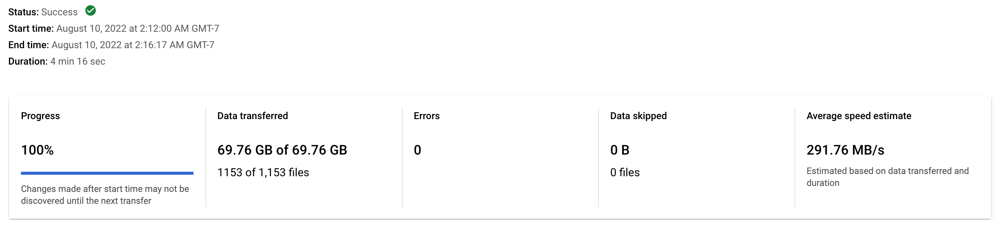
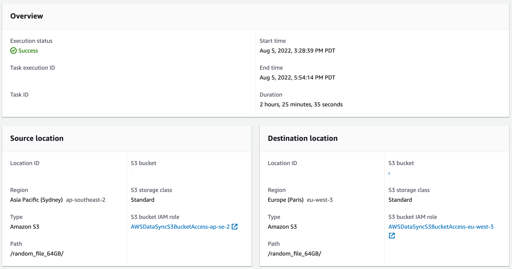

# Benchmark instructions

## Skyplane vs AWS DataSync small file

### Setup

For this experiment, we choose **fake_imagenet** (from Google [here](https://cloud.google.com/tpu/docs/tutorials/resnet#run-model)) as the testing file and pick **Sydney** and **Paris** as two endpoints to transfer. The fake_imagenet has size of about 70 GB and contains batches of training, validation, and test datasets.

#### Skyplane

To time the entire process of Skyplane transfer, we use linux `time` command. We add `-y` argument which enables auto confirm to reduce time waiting for response. We use 8 VMs per source/destination region. Below is an example of the code we run:

```bash
$ time skyplane cp -r -y s3://{bucket name in ap-southeast-2 region}/fake_imagenet/ s3://{bucket name in eu-west-3 region}/fake_imagenet/ -n 8
```

In the output, you will find

```bash
✅ Transfer completed successfully
Transfer runtime: 28.11s, Throughput: 19.85Gbps
```

This is the result we include in the plot where we compare only the transfer time (provisioning time, etc. are excluded).

#### DataSync

We use AWS DataSync for comparison. Instructions on how to set up it can be found [here](https://aws.amazon.com/blogs/storage/migrating-google-cloud-storage-to-amazon-s3-using-aws-datasync/). Then, we can launch a task for transfer. Below is a snapshot of such task:


## Skyplane vs GCP Data Transfer small file

### Setup

For this experiment, we choose **fake_imagenet** (from Google [here](https://cloud.google.com/tpu/docs/tutorials/resnet#run-model)) as the testing file and pick different regions to transfer. The fake_imagenet has size of about 70 GB and contains batches of training, validation, and test datasets.

#### Skyplane

To time the entire process of Skyplane transfer, we use linux `time` command. We add `-y` argument which enables auto confirm to reduce time waiting for response. We use 8 VMs per source/destination region. Below is an example of the code we run:

```bash
$ time skyplane cp -r -y s3://{bucket name in source region}/fake_imagenet/ gs://{bucket name in destination region}/fake_imagenet/ -n 8
```

In the output, you will find

```bash
✅ Transfer completed successfully
Transfer runtime: 28.73s, Throughput: 19.42Gbps
```

This is the result we include in the plot where we compare only the transfer time (provisioning time, etc. are excluded).

#### Data Transfer

We use Google Cloud Data Transfer for comparison. Instructions on how to set up it can be found [here](https://cloud.google.com/storage-transfer/docs/create-transfers). Then, we can launch a job for transfer. Below is a snapshot of such job:




## Skyplane vs AWS DataSync for large files

### Setup

For this experiment, we choose **randomly** generated **large files** of fixed sizes as the testing file and pick **Sydney** and **Paris** as two endpoints to transfer. The random files have sizes of 4 GB, 8 GB, 16 GB, 32 GB, and 64 GB, each generated by linux command `head -c {size}G </dev/urandom>myfile`.

#### Skyplane

To time the entire process of Skyplane transfer, we use linux `time` command. We add `-y` argument which enables auto confirm to reduce time waiting for response. We use 8 VMs per source/destination region. Below is an example of the code we run:

```bash
$ time skyplane cp -r -y s3://{bucket name in ap-southeast-2 region}/random_file_64GB s3://{bucket name in eu-west-3 region}/random_file_64GB -n 8
```

In the output, you will find

```bash
✅ Transfer completed successfully
Transfer runtime: 76.59s, Throughput: 6.69Gbps
```

This is the result we include in the plot where we compare only the transfer time (provisioning time, etc. are excluded).

#### DataSync

We use AWS DataSync for comparison. Instructions on how to set up it can be found [here](https://aws.amazon.com/blogs/storage/migrating-google-cloud-storage-to-amazon-s3-using-aws-datasync/). Then, we can launch a task for transfer. Below is a snapshot of such task:



## Skyplane vs AWS DataSync vs Rsync for transfer cost

### Setup

For this experiment, we choose **uncompressed** 223GB dump of English **Wikipedia** (from [here](https://dumps.wikimedia.org/other/static_html_dumps/current/en/)) as the testing file and pick **North Virginia** and **Oregon** as two endpoints to transfer. The wikipedia dump is first uncompressed to tar file and then sharded to 16 MB chunks by linux command `split -b`.

### Skyplane

To time the entire process of Skyplane transfer, we use linux `time` command. We add `-y` argument which enables auto confirm to reduce time waiting for response. We use 1 VM per source/destination region. Below is an example of the code we run:

```bash
$ time skyplane cp -r -y s3://{bucket name in us-east-1 region}/wiki_dumps s3://{bucket name in us-west-2 region}/wiki_dumps -n 1
```

In the output, you will find

```bash
✅ Transfer completed successfully
Transfer runtime: 266.23s, Throughput: 6.26Gbps
```

This is the transfer time (provisioning time, etc. are excluded) that costs us money for using AWS EC2 VMs.

You will also find

```bash
Compression saved 78.94% of egress fees
```

This indicates the percentage of the data transfer (egress) fee saved by Skyplane's own compression algorithm.

To calculate the cost, we need two numbers: 1. the cost for transfering data out from N. Virginia to Oregon, which is \$0.02 per GB; 2. the cost for using on-demand VMs (of type m5.8xlarge) in N. Virginia and Oregon, which is \$1.536 per hour. The values are found from AWS [here](https://aws.amazon.com/ec2/pricing/on-demand/).

The total cost for Skyplane transfer is

```
223.67 GB * (1 - 0.7894) * $0.02 / GB + 2 * $(1.536 / 3600) / s * 266.23 s = $1.17
```

### DataSync

We use AWS DataSync for comparison. Instructions on how to set up it can be found [here](https://aws.amazon.com/blogs/storage/migrating-google-cloud-storage-to-amazon-s3-using-aws-datasync/). Then, we can launch a task for transfer. Below is a snapshot of such task:


To calculate the cost, we need one extra number: the cost for using AWS DataSync service to copy data, which is \$0.0125 per GB. It can be found [here](https://aws.amazon.com/datasync/pricing/).

The total cost for AWS DataSync transfer is

```
223.67 GB * ($0.02 + $0.0125) / GB = $7.27
```

which is independent on the transfer speed.

### Rsync

We also use [rsync](https://download.samba.org/pub/rsync/rsync.1) for comparison. First we need to mount AWS S3 buckets in AWS EC2 VMs by using the [s3fs](https://github.com/s3fs-fuse/s3fs-fuse) tool. An example command would be `s3fs mybucket /path/to/mountpoint`. Then, we can treat folders in EC2 VMs as folders in S3 buckets and use rsync to transfer. To do that, we have one VM in Oregon as local client and treat the other VM in N. Virginia as remote client.

In addition, rsync can compress the file data as it is sent to the destination client. We do so by `rsync -z` command argument. It uses [zlib](https://www.zlib.net/manual.html) to compress the data, and by default level of compression, it saves 86% of egress fee. The percentage is found by the following command:

```bash
pigz -6 -z -r -v wiki_dumps/
```

To time the entire process of rsync transfer, we use linux `time` command. Finally, below is an example of the code we run:

```bash
time rsync -az -e "ssh -i .ssh/{key to access Virginia VM}.pem" ubuntu@Virginia_VM-IP-Address:~/us-east-1/ us-west-2/
```

In the output, you will find

```bash
real    396m46.729s
user    0m23.663s
sys     0m19.536s
```

The `real` time is how long we have used our AWS EC2 VMs.

The total cost for rsync transfer is

```
223.67 GB * (1 - 0.8608) * $0.02 / GB + 2 * $(1.536 / 3600) / s * 23807 s = $20.94
```
