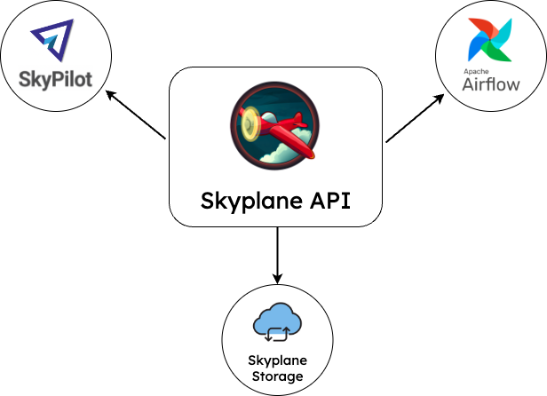
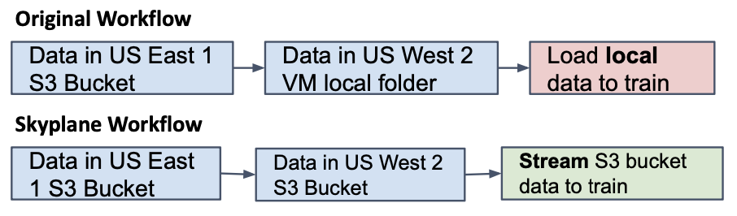
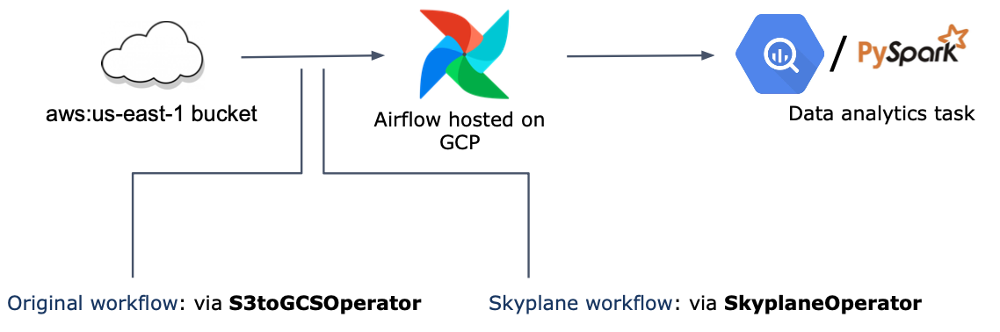

=================
API documentation
=================

Welcome to Skyplane API!
========================

Skyplane's ease of use and efficiency make it a popular choice among developers for handling data transfer across the cloud. With its API, developers can easily integrate Skyplane into their project pipelines (e.g. `ML training example <https://github.com/skyplane-project/skyplane/tree/main/examples>`__) and utilize the same functionality as the command line interface (CLI) such as copying and syncing, along with additional features exclusive to the API. This opens up new opportunities for the growth and application of Skyplane in the future.

.. note::

    This API is still experimental, and your feedback is much appreciated in improving it!

Installing Skyplane
===================

We have provided a detailed tutorial `here <https://skyplane.org/en/latest/quickstart.html>`__.

How to import Skyplane
======================

To access Skyplane and its functions, you can import it in your Python code like this:
.. code-block:: python

    import skyplane

Really easy!

How to launch a Skyplane transfer job
======================================

To start, you need to create a Skyplane client that reads the cloud keys. Every transfer job is managed by this client or the dataplane configured by the client.

Then, Skyplane provides two different ways to transfer: 1. simply copy that takes care of the VM provision and deprovision so you can launch a transfer with one line; 2. dataplane session that gives you more freedom to launch multiple transfer jobs together and asynchronously.

Dataplane calculates the optimal transfer topology between the source and the destination regions and can be reused to launch jobs later.

Below are the two examples using the methods mentioned above.

.. code-block:: python
    :caption: Example of how to use API simple copy that automatically deprovisions the VMs

    import skyplane

    client = skyplane.SkyplaneClient(aws_config=skyplane.AWSConfig())
    print(f"Log dir: {client.log_dir}/client.log")
    client.copy(src="s3://skycamp-demo-src/synset_labels.txt", dst="s3://skycamp-demo-us-east-2/imagenet-bucket/synset_labels.txt", recursive=False)

.. code-block:: python
    :caption: Example of how to use API dataplane session

    # from https://github.com/skyplane-project/skyplane/blob/main/examples/api_demo.py
    import skyplane

    client = skyplane.SkyplaneClient(aws_config=skyplane.AWSConfig())
    print(f"Log dir: {client.log_dir}/client.log")
    dp = client.dataplane("aws", "us-east-1", "aws", "us-east-2", n_vms=1)
    with dp.auto_deprovision():
        dp.provision()
        dp.queue_copy(
            "s3://skycamp-demo-src/synset_labels.txt", "s3://skycamp-demo-us-east-2/imagenet-bucket/synset_labels.txt", recursive=False
        )
        tracker = dp.run_async()
        # You can monitor the transfer by querying tracker.query_bytes_remaining()

Integrations with other applications
====================================

ImageNet ML training example
----------------------------

See full workflow `here <https://github.com/skyplane-project/skyplane/tree/main/examples>`__.

Large-scale machine learning (ML) training typically includes a step for acquiring training data. The following example illustrates an ML workflow where the original ImageNet data is stored in an S3 bucket in the US-East-1 region.

In many cases, datasets and virtual machines (VMs) are located in different regions. This can lead to slow data transfer speeds and high costs for data egress fees when using cloud provider tools, such as aws s3 cp, to download data to the VM's local disk. Skyplane offers a solution by allowing a fast and more cost-effective transfer of the dataset to an S3 bucket in the same region as the VM (e.g. US-West-2), with direct streaming of the data to the model without the need for downloading it to the local folder.

This process is as simple as adding just two lines of code, similar to the demonstration of the Skyplane simple copy.

.. code-block:: python

    # Step 1:  Create a Skyplane API client. It will read your AWS credentials from the AWS CLI by default
    client = skyplane.SkyplaneClient(aws_config=skyplane.AWSConfig())

    # Step 2:  Copy the data from the remote bucket to the local bucket.
    client.copy(src=args.remote_s3_path, dst=args.local_s3_path, recursive=True)

Airflow SkyplaneOperator
------------------------

Skyplane can be easily incorporated into an Airflow DAG using a SkyplaneOperator, which can be utilized in data transfer tasks, such as replacing the S3toGCSOperator. The following example demonstrates a data analytics workflow where data is transferred from S3 to GCS to build a BigQuery dataset and then used in a PySpark data analysis job.

Contents
========

.. toctree::
    :maxdepth: 2

    _api/skyplane.api
