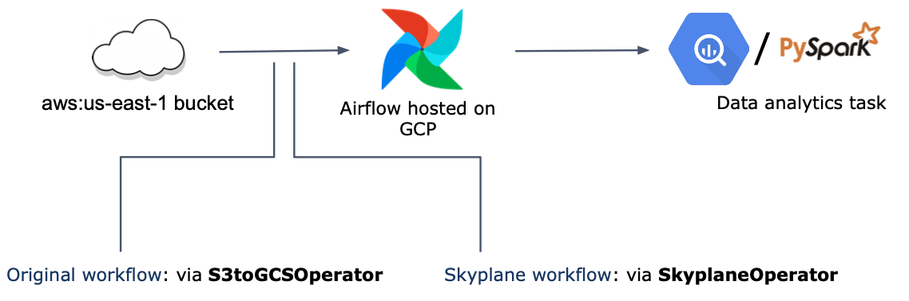

# Creating an Airflow Operator 

Skyplane can be easily incorporated into an Airflow DAG using a SkyplaneOperator, which can be utilized in data transfer tasks, such as replacing the S3toGCSOperator. The following example demonstrates a data analytics workflow where data is transferred from S3 to GCS to build a BigQuery dataset and then used in a PySpark data analysis job.



In this tutorial, we extend Airflow's `BaseOperator` object to create a custom Skyplane operator, called `SkyplaneOperator`. We first define the fields of the `SkyplaneOperator`: 
```
import skyplane
from airflow.models import BaseOperator  # type: ignore

class SkyplaneOperator(BaseOperator):
    template_fields = (
        "src_provider",
        "src_bucket",
        "src_region",
        "dst_provider",
        "dst_bucket",
        "dst_region",
        "config_path",
    )

    def __init__(
        self,
        *src_provider: str,
        src_bucket: str,
        src_region: str,
        dst_provider: str,
        dst_bucket: str,
        dst_region: str,
        aws_config: Optional[skyplane.AWSConfig] = None,
        gcp_config: Optional[skyplane.GCPConfig] = None,
        azure_config: Optional[skyplane.AzureConfig] = None,
        **kwargs,
    ) -> None:
        super().__init__(**kwargs)
        self.src_provider = src_provider
        self.src_bucket = src_bucket
        self.src_region = src_region
        self.dst_provider = dst_provider
        self.dst_bucket = dst_bucket
        self.dst_region = dst_region
        self.aws_config = aws_config
        self.gcp_config = gcp_config
        self.azure_config = azure_config


def execute(self, context):
    pass
```
Inside the `execute` function, we can instantiate a Skyplane client to create a dataplane and execute transfers: 
```

def execute(self, context):
    client = SkyplaneClient(aws_config=self.aws_config, gcp_config=self.gcp_config, azure_config=self.azure_config)
    dp = client.dataplane(self.src_provider, self.src_region, self.dst_provider, self.dst_region, n_vms=1)
    with dp.auto_deprovision():
        dp.provision()
        dp.queue_copy(self.src_bucket, self.dst_bucket, recursive=True)
        tracker = dp.run_async()
```
We can also add reporting on the transfer: 
```
    with dp.auto_deprovision():
        ...
        print("Waiting for transfer to complete...")
        while True:
            bytes_remaining = tracker.query_bytes_remaining()
            if bytes_remaining is None:
                print(f"{timestamp} Transfer not yet started")
            elif bytes_remaining > 0:
                print(f"{(bytes_remaining / (2 ** 30)):.2f}GB left")
            else:
                break
            time.sleep(1)
        tracker.join()
        print("Transfer complete!")
```